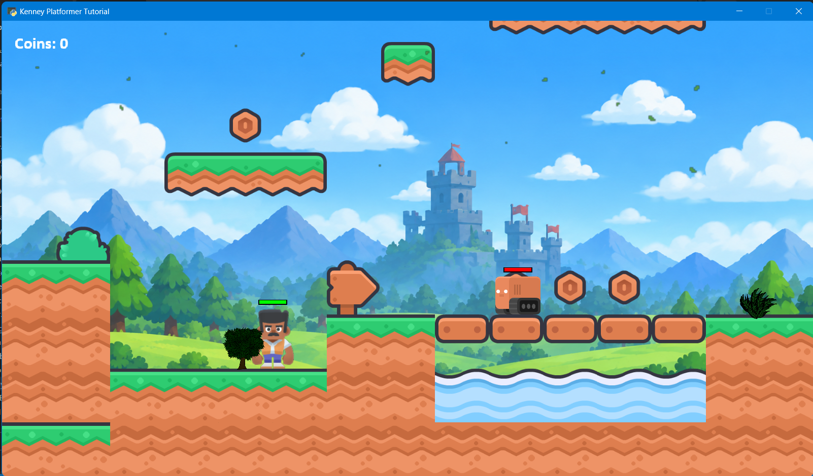
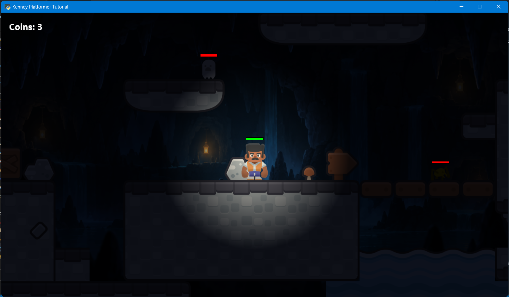
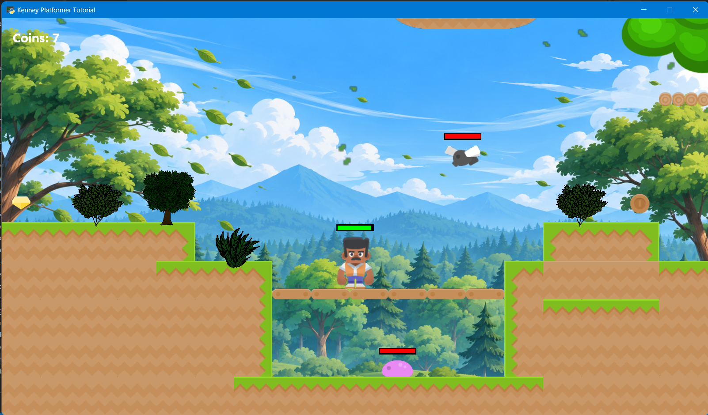
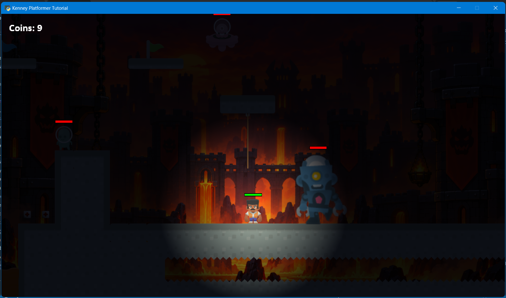

# Kenney Platformer Tutorial

Python Arcade 2D platformer using Kenney assets in sort of a Super Kenney Bros game.

Level 1

Level 2

Level 3

Level 4

Assets:
- [Kenny](kenny.nl)
- NaturePack by Bad Rock Studios
- Backgrounds generated by ChatGPT AI

See Obsidian Tutorial Text for documentation.
